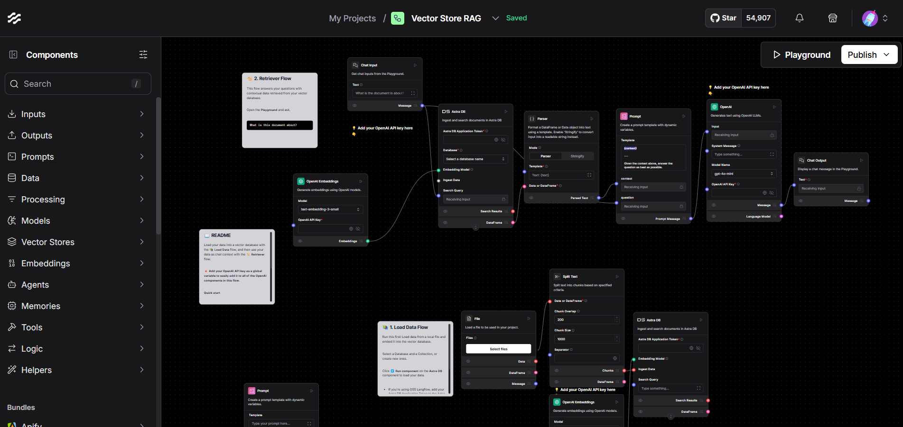

# IBM watsonx.ai Integration with Langflow

This tutorial presents a complete and structured guide to integrating **IBM watsonx.ai** foundation models into the **Langflow** visual programming environment using custom components. You will learn how to install Langflow, configure IBM watsonx.ai, develop chatbot and agent flows, and incorporate vector-based Retrieval Augmented Generation (RAG).

## Project Structure Overview

```
langflow-watsonx-integration/
├── .gitignore
├── LICENSE
├── README.md
├── requirements.txt
├── install.sh                  # Installation script for setting up the environment
└── components/
    ├── llm/
    │   └── watsonx.py          # IBM watsonx.ai LLM integration
    └── embeddings/
        └── watsonx_embedding.py  # IBM watsonx.ai Embedding integration
```

This structure allows you to easily extend or embed the components into a Langflow-based application.

## Features of the Integration

- Custom components compatible with Langflow's architecture.
- Secure API key handling using `SecretStrInput`.
- Comprehensive parameterization of text generation (temperature, top_p, max_tokens, logprobs, etc.).
- Automatic dynamic retrieval of available watsonx.ai models.
- Embedding generation for use in RAG and vector search pipelines.
- Example agent flow integration with Langflow’s tool-calling framework.

## Installation and Environment Setup

### Prerequisites

To install Langflow and use this integration, you will need:

- Python 3.11 to 3.13
- `uv`, `pip`, or `pipx` for package management (uv is recommended)
- A virtual environment for isolation (optional but recommended)
- An IBM watsonx.ai account with a valid API key and project ID

### Installing the Environment with `install.sh`

You can set up the environment automatically by running the provided installation script. Open your terminal in the project directory and execute:

```bash
bash install.sh
```

This script will:
- Update system packages and install necessary dependencies.
- Set up Python 3.11 (or a compatible version) along with pip.
- Create and activate a virtual environment (named `.venv`).
- Install Langflow and required dependencies.
- Verify that the environment is ready for running Langflow.

### Step 1: Start Langflow

After the installation completes, activate your virtual environment:

```bash
source .venv/bin/activate
```

Then start Langflow:

```bash
langflow run
```

Open your browser and navigate to [http://127.0.0.1:7860](http://127.0.0.1:7860) to access the visual interface.

## Adding IBM watsonx.ai Integration

### Step 1: Prepare Components

Create directories for Langflow custom components:

```bash
mkdir -p ~/.langflow/components/llm ~/.langflow/components/embeddings
```

Copy the provided files into these locations:

```bash
cp components/llm/watsonx.py ~/.langflow/components/llm/
cp components/embeddings/watsonx_embeddings.py ~/.langflow/components/embeddings/
```

### Step 2: Configure IBM watsonx.ai Access

To use IBM watsonx.ai, you will need:

- An IBM Cloud account
- A watsonx.ai project
- A project ID
- An API key

Visit [IBM watsonx.ai](https://dataplatform.cloud.ibm.com/) to create a project and retrieve these values.

Supported endpoint regions include:

- `https://us-south.ml.cloud.ibm.com`
- `https://eu-de.ml.cloud.ibm.com`
- `https://eu-gb.ml.cloud.ibm.com`
- `https://au-syd.ml.cloud.ibm.com`
- `https://jp-tok.ml.cloud.ibm.com`
- `https://ca-tor.ml.cloud.ibm.com`

### Step 3: Test Available Models

Run the following script to list available embeddings models in your region:

```bash
python components/utils/list_embeddings.py
```


```bash
python components/utils/list_models.py
```


This script queries the watsonx.ai model endpoint for currently supported models and lists them in the terminal.

## Creating Your First Langflow Flow with watsonx.ai

### Step-by-Step Guide to Create a Single Agent RAG Flow

This guide will walk you through creating a single agent flow that uses Retrieval Augmented Generation (RAG).

1. **Open the Langflow Interface:**
   - In your browser, navigate to [http://127.0.0.1:7860](http://127.0.0.1:7860).

2. **Create a New Flow:**
   - Click on **New Flow** and choose **Blank Flow** to start with an empty canvas.

3. **Add Components:**
   - **Chat Input:** Drag and drop a **Chat Input** component—this will be your query input.
   - **Prompt:** Add a **Prompt** component to transform and prepare the input for further processing.
   - **IBM watsonx.ai Embedding:** Drag the `IBM watsonx.ai Embedding` component (from your installed custom components) to generate embeddings from the prompt.
   - **Vector Store:** Add a **Vector Store** component (compatible with Langflow, such as FAISS, Chroma, or Astra DB) to index the embeddings.
   - **Retriever:** Insert a **Retriever** component that will search the vector store to fetch relevant context.
   - **IBM watsonx.ai LLM:** Drag the `IBM watsonx.ai LLM` component to generate responses that combine the original prompt with the retrieved context.
   - **Chat Output:** Finally, add a **Chat Output** component to display the final answer.

4. **Connect the Components:**

   Arrange and connect the components in this logical order:
   ```
   Chat Input → Prompt → IBM watsonx.ai Embedding → Vector Store → Retriever → IBM watsonx.ai LLM → Chat Output
   ```
   This creates a RAG workflow where the user input is embedded and compared against a vector store. The LLM then uses the retrieved contextual information to generate a comprehensive response.

5. **Configure the IBM watsonx.ai Components:**
   - **For the Embedding Component:** Verify that it is correctly set up; typically, no extra configuration is required.
   - **For the LLM Component:**
     - **API Key:** Enter your IBM watsonx.ai API key.
     - **Project ID:** Provide your watsonx.ai project identifier.
     - **Endpoint URL:** Select or input your regional endpoint URL.
     - **Model Name:** Choose the desired model from the dynamically loaded list.
     - **Optional Parameters:** Adjust additional settings such as `temperature`, `max_tokens`, etc., as needed.

6. **Save and Test Your Flow:**
   - Click **Save** to store your flow.
   - Use the **Playground** feature or simply enter a query via **Chat Input**.
   - For example, type **"Summarize the latest advances in AI."**
   - Verify that the system retrieves relevant context from your vector store and that the LLM produces an appropriate answer.

## Building a Simple Agent with Langflow and watsonx.ai

Langflow also supports creating tool-enabled agents. Here’s how to set up a basic agent:

1. **Create a New Flow:**
   - Click **New Flow** and select **Simple Agent**.

2. **Replace Default Components:**
   - Replace the default LLM component with the **IBM watsonx.ai LLM** component.
   - Add additional tools (e.g., URL reader, calculator) as required.

3. **Connect the Components:**
   - Connect **Chat Input** to the agent component.
   - Link the agent component to **Chat Output**.

4. **Test the Agent:**
   - In Playground mode, try a sample query such as **"Create a tabletop RPG character."**
   - Observe how the agent uses the IBM watsonx.ai service (and any integrated tools) to generate a response.

## Using the Components in Python Code

For CLI or script-based testing, you can also use the components standalone in your Python code:

```python
from components.llm.watsonx import WatsonxComponent

component = WatsonxComponent()
llm = component.build_model()
response = llm("Tell me about the IBM watsonx.ai platform.")
print(response)
```

This allows you to integrate IBM watsonx.ai into your own scripts or applications, independent of the Langflow UI.

## Troubleshooting & Support

- If `langflow run` fails, try:
  ```bash
  python -m langflow run
  ```
- For dependency resolution issues, use:
  ```bash
  uv pip install langflow
  ```
- For migration or cache problems, clear the `.cache/langflow/` directory in your home folder.
- Consult the [Langflow Documentation](https://docs.langflow.org) or IBM watsonx.ai support for additional help.

## Conclusion

This tutorial demonstrated how to:

- Set up Langflow locally using `bash install.sh`
- Integrate IBM watsonx.ai using custom Langflow components
- Build interactive flows including chatbots, agent-based interactions, and RAG workflows
- Extend functionality with embeddings and vector-based retrieval

With this foundation, you can prototype and build powerful AI-driven workflows by combining IBM watsonx.ai foundation models with Langflow’s intuitive visual interface.

---

Enjoy creating your AI experiences with IBM watsonx.ai and Langflow!
